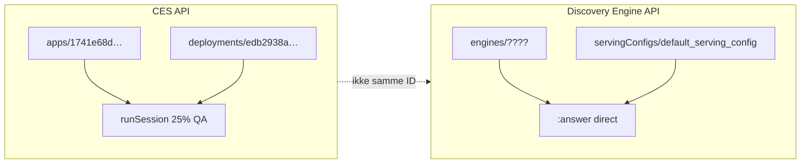

# Google Agent Search — Engine / ServingConfig resource verification v0.1

Status: **Resolved** — working engine ID documented in [known-good](./GOOGLE_AGENT_SEARCH_DIRECT_KNOWN_GOOD_v0_1.md)  
Related: [#198](https://github.com/THUNDERPLUNDER/vox-web/issues/198), [IAM audit](./GOOGLE_AGENT_SEARCH_IAM_VERIFICATION_v0_1.md)

---

## 1. Konklusjon (bekreftet av Google)

| Felt | Verdi | API-ressurs |
|------|--------|-------------|
| `CES_APP_ID` | `1741e68d-0528-4625-8b83-99a0dbb5298f` | **CES:** `projects/…/locations/eu/**apps**/{id}` |
| Discovery Engine | **annen ID** | **DE:** `projects/…/locations/eu/collections/default_collection/**engines**/{id}` |

**Google-feil etter IAM-fix:**

```
INVALID_ARGUMENT — Cannot fetch Engine for: 1741e68d-0528-4625-8b83-99a0dbb5298f
```

**Tolkning:** IAM (`discoveryengine.servingConfigs.answer`) er OK. Vi har kalt `:answer` med **CES app UUID** som om det var en **engine** — det er feil resource type.

**Direct `:answer` passer ikke dette oppsettet** med kun `CES_APP_ID` — med mindre dere finner en tilhørende Discovery Engine med **egen** engine-ID i GCP.

---

## 2. To parallelle lag (samme GCP-prosjekt, ulik API)



| Lag | Base URL | Headless i Viddel |
|-----|----------|-------------------|
| CES | `ces.googleapis.com/v1beta` | `/api/chat` → `runSession` ✅ |
| Discovery Engine | `eu-discoveryengine.googleapis.com/v1` | Direct `:answer` — krever **AGENT_SEARCH_ENGINE_ID** |

---

## 3. Finn riktig Engine ID (Thomas / GCP)

### A. Console

1. [Google Cloud Console](https://console.cloud.google.com/) → prosjekt **`hearing-aid-mvp`**
2. **Agent Builder** / **Vertex AI Search** / **Discovery Engine** → **Apps** eller **Engines**
3. Åpne appen som skal brukes til **søk/svar** (ikke bare CES Agent Studio «API access»-kanal)
4. Noter resource name — siste segment etter `engines/`:

```
projects/hearing-aid-mvp/locations/eu/collections/default_collection/engines/{ENGINE_ID}
```

**Ikke** bruk ID fra `…/apps/1741e68d-…` (CES).

### B. gcloud (liste engines)

```bash
gcloud discovery-engine engines list \
  --project=hearing-aid-mvp \
  --location=eu \
  --collection=default_collection
```

Eller REST (med SA eller user token):

```http
GET https://eu-discoveryengine.googleapis.com/v1/projects/hearing-aid-mvp/locations/eu/collections/default_collection/engines
```

### C. Sammenlign med CES

| Spørsmål | Forventet |
|----------|-----------|
| Er `1741e68d-…` i engine-listen? | **Nei** (preview QA bekrefter via Google) |
| Finnes annen engine for Viddel? | Noter **den** ID-en |
| Finnes ingen engine? | Direct `:answer` er **ikke** koblet til CES-appen — behold `runSession` |

---

## 4. ServingConfig for `:answer`

| Config | Bruk |
|--------|------|
| **`default_serving_config`** | Anbefalt for `:answer` (offisielle SDK-eksempler) |
| `default_search` | Ofte brukt i curl for `:answer` på search apps; kan testes via env |
| `default_agent_answer` | Kun når custom AI_MODE agent engine er satt opp |

**Env:**

```bash
AGENT_SEARCH_SERVING_CONFIG=default_serving_config   # default i kode
# AGENT_SEARCH_SERVING_CONFIG=default_search         # alternativ test
```

**Path (etter engine ID er funnet):**

```
…/engines/{AGENT_SEARCH_ENGINE_ID}/servingConfigs/{AGENT_SEARCH_SERVING_CONFIG}:answer
```

---

## 5. Env-endring (repo)

| Variabel | Formål |
|----------|--------|
| `CES_APP_ID` | **Kun** CES `runSession` — ikke Discovery Engine |
| `AGENT_SEARCH_ENGINE_ID` | **Påkrevd** for direct `:answer` / probe |
| `AGENT_SEARCH_SERVING_CONFIG` | Valgfri override (default `default_serving_config`) |
| `AGENT_SEARCH_LOCATION` | Valgfri override (default `CES_LOCATION` / `eu`) |

**Kode (fra denne commit):** `resolveAgentSearchEnv()` bruker **ikke** lenger `CES_APP_ID` som fallback til engine.

Sett i **Vercel Preview** (og test deretter):

```
AGENT_SEARCH_ENGINE_ID=<engine-id-fra-gcp>
```

---

## 6. Acceptance etter fix

1. `AGENT_SEARCH_ENGINE_ID` satt til ekte engine fra GCP
2. Preview probe → minst **ett** kall: Google **200**, `has_answer: ja`, `error_code` null
3. Eller presis konklusjon: **ingen engine** for denne agenten → direct API er ikke riktig spor; fortsett CES channel + vurder fallback (#198)

**Ikke merge #213** før 200 eller skriftlig GCP-konklusjon.

---

## 7. Referanser

- [servingConfigs.answer](https://cloud.google.com/generative-ai-app-builder/docs/reference/rest/v1/projects.locations.collections.engines.servingConfigs/answer)
- [engines.list](https://cloud.google.com/generative-ai-app-builder/docs/reference/rest/v1/projects.locations.collections.engines/list)
- [CES env checklist](./CES_ENV_VERIFICATION_CHECKLIST_v0_1.md)
